<h1 align="center">🍽️ Foodie</h1>

<p align="center">
  A beautifully crafted food delivery app built with Expo SDK 55 and React Native.<br/>
  Dynamic themes, smooth animations, and a personality that makes you want to stay.
</p>

<p align="center">
  
  
  
  
</p>

---

## Overview

Foodie is a full-featured food delivery experience with a live theme engine that transforms the entire app — colors, gradients, backgrounds — based on whether you're browsing all food, veg only, or non-veg. Every screen is reactive, every interaction is animated, and every screen has personality.

---
## 🎥 Demo Video
👉 [Click here to watch the demo](https://drive.google.com/file/d/1VgTsW21DsHsNadTi17DwRezEwhW9Jm8l/view?usp=drivesdk)

### Authentication

| `SignIn.jpeg` | `Signup.jpeg` |
|:---:|:---:|
| 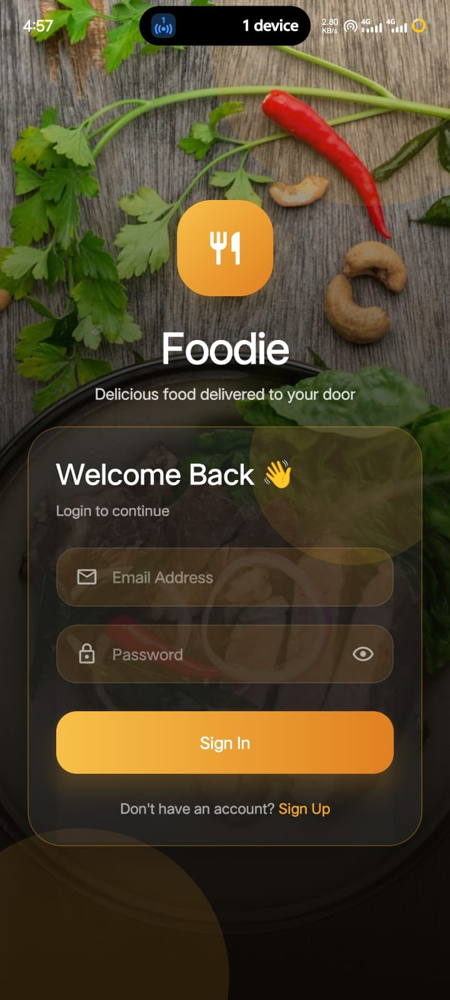 | 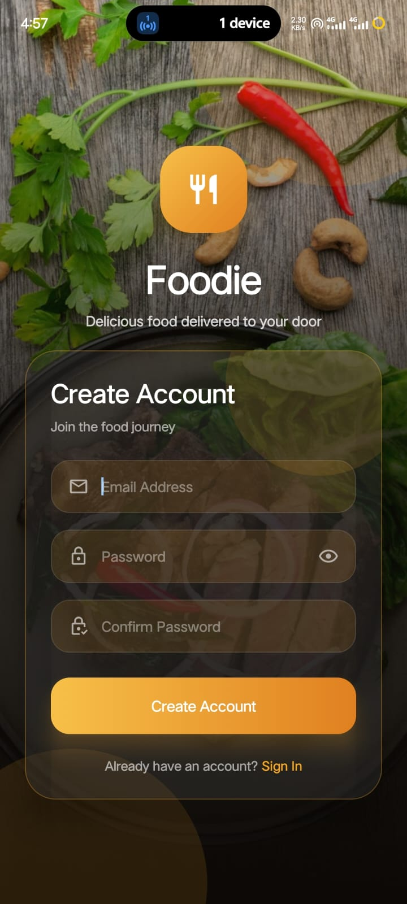 |
| Sign In | Sign Up |

Glassmorphic login card over a food hero image. BlurView card with animated entrance, email + password fields, show/hide password toggle, spring-animated submit button, and a rotating food quote that refreshes every 10 seconds.

### Onboarding

| `onboarding1.jpeg` | `onboarding2.jpeg` | `onboarding3.jpeg` | `onboarding4.jpeg` |
|:---:|:---:|:---:|:---:|
| 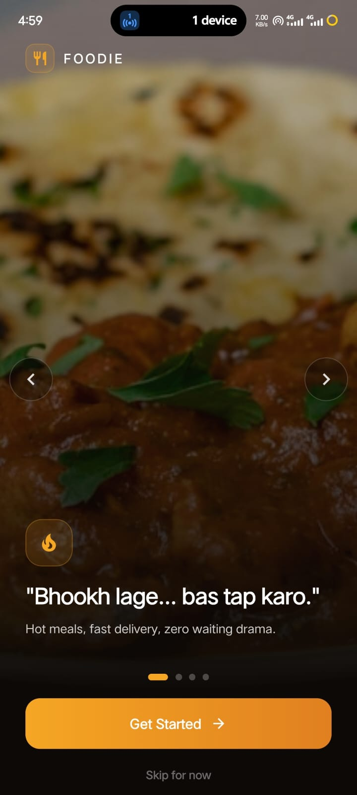 | 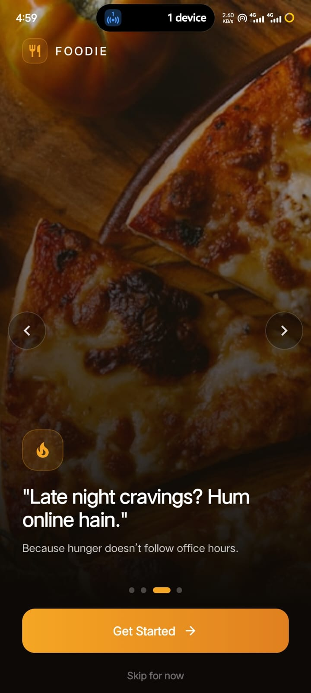 | 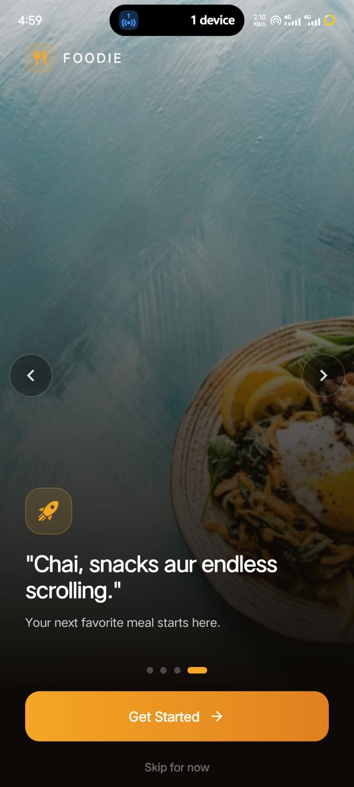 | 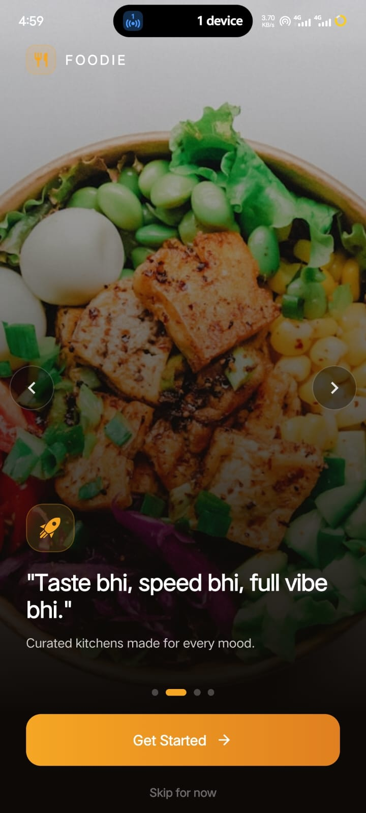 |
| Slide 1 — Hunger hook | Slide 2 — Curated kitchens | Slide 3 — Late night | Slide 4 — Personal picks |

Full-screen immersive slides with Hindi + English taglines, animated fade transitions, dot indicators, left/right edge tap arrows, and a "Get Started" CTA. Auto-advances every 3.8 seconds.

---

### Home

| `home1.jpeg` | `home2.jpeg` |
|:---:|:---:|
| 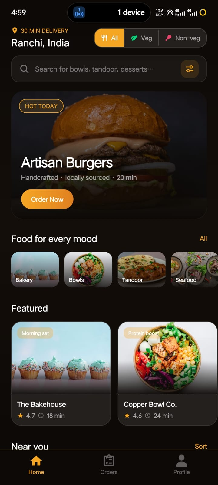 | 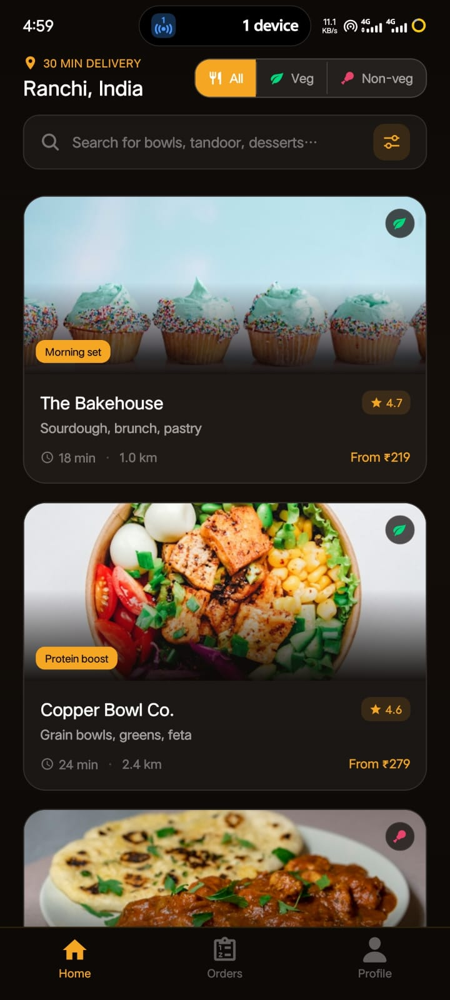 |
| Home — Hero & Featured | Home — Near You |

Hero banner, horizontally scrollable categories and featured cards, and a vertical restaurant feed. The **All / Veg / Non-veg** toggle in the header drives both the restaurant filter and the live app theme simultaneously.

---

### Search

| `search.jpeg` | `restaurant list in search.jpeg` |
|:---:|:---:|
| 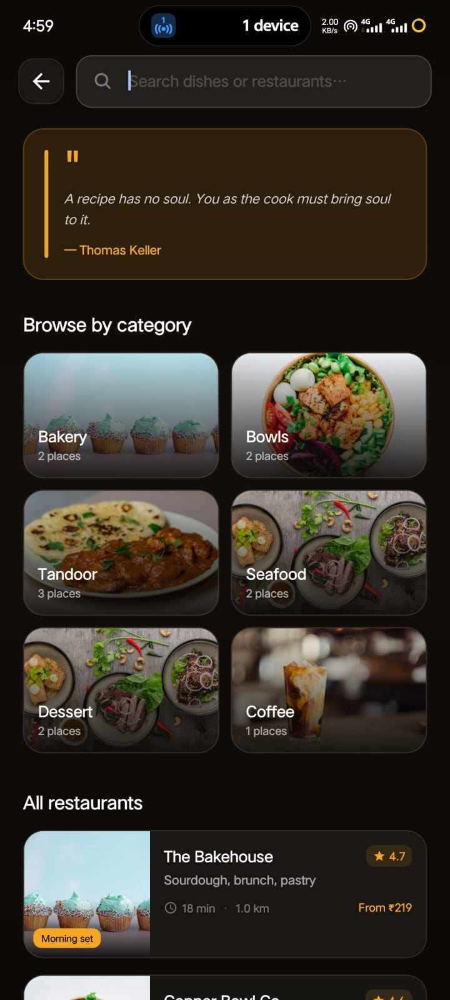 |  |
| Browse by category | Search results |

Auto-focused search bar with real-time filtering across name, cuisine, and category. Empty state shows a category image grid and a rotating food quote. Results display restaurant rows with offer pills, ratings, and delivery times.

---

### Restaurant & Cart

| `restaurant screen.jpeg` | `add items to cart.jpeg` | `cart.jpeg` |
|:---:|:---:|:---:|
|  |  | 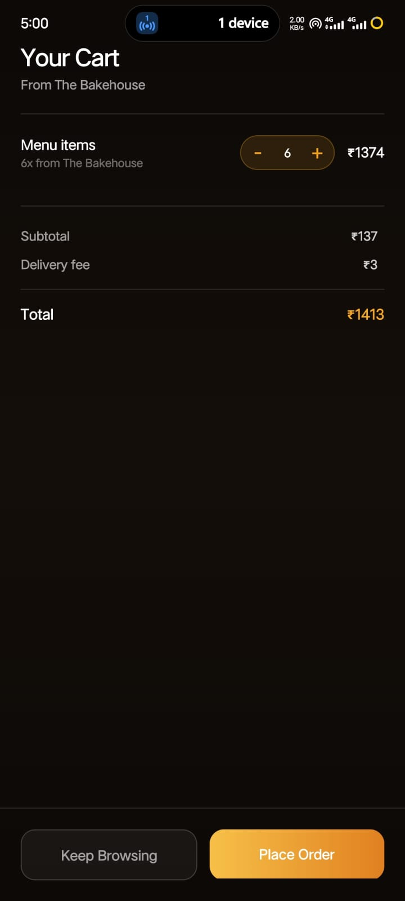 |
| Restaurant detail | Add items | Cart |

Restaurant detail page with hero image, info pills, and a full menu. Items can be added with quantity controls. The cart screen shows itemized order summary, pricing breakdown, and a checkout CTA.

---

### Orders

| `order placed.jpeg` | `myorders.jpeg` |
|:---:|:---:|
|  | 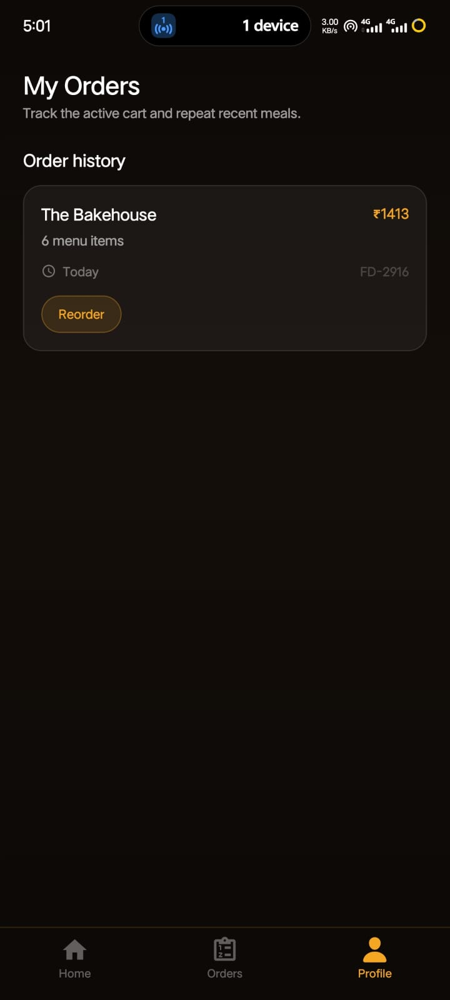 |
| Order confirmed | Order history |

Order placed screen shows a themed confirmation with a rotating food quote. My Orders lists full order history with date, total, and a one-tap **Reorder** button that restores cart state.

---

### Profile & Account

| `profile.jpeg` | `logout_modal.jpeg` |
|:---:|:---:|
| 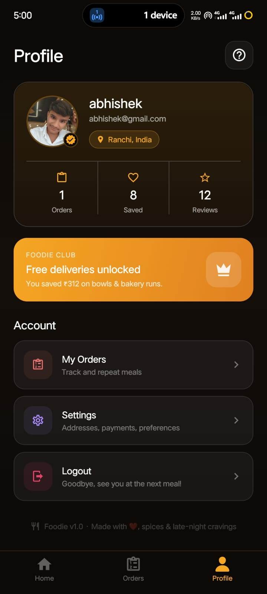 | 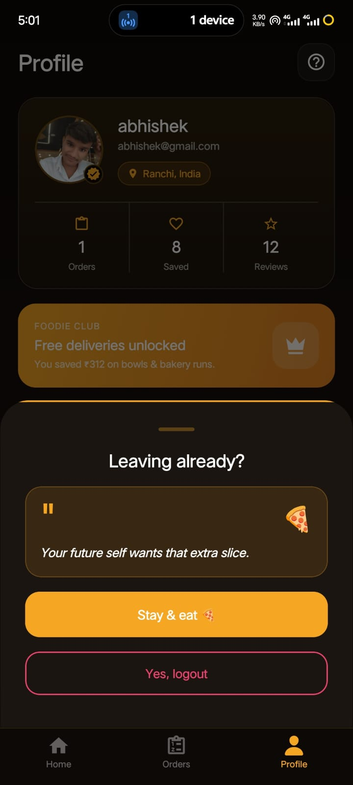 |
| Profile | Logout modal |

Profile card with avatar, stats (orders, saved, reviews), Foodie Club membership banner, and quick-access rows for orders, settings, and help. The logout modal features a glassmorphic panel with a randomly selected cheesy Hindi/English line to convince you to stay.

---

### Settings & Help

| `setting.jpeg` | `help.jpeg` |
|:---:|:---:|
| 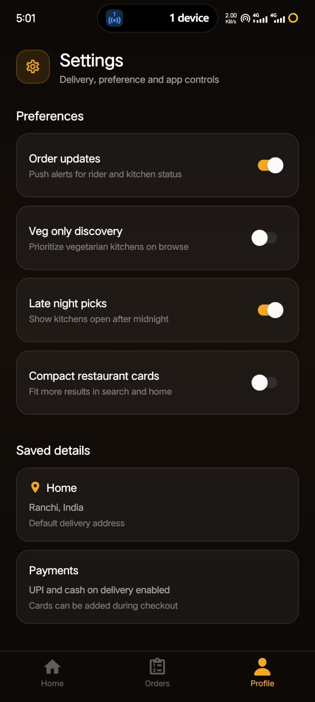 | 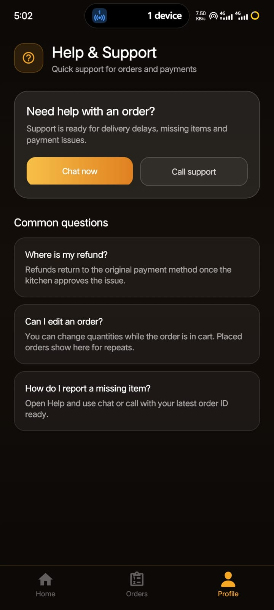 |
| Settings | Help & Support |

Settings screen includes **Veg only discovery** toggle (wires directly into the global food filter and theme), push alert controls, late-night picks, and compact card mode. Help screen has live chat / call support and an FAQ section.

---

## Features

### Live Theme Engine
The app ships three complete themes driven by a single `FoodFilter` state:

| Filter | Accent | Background | Gradient |
|--------|--------|------------|----------|
| **All** | Gold `#F5A623` | Warm dark `#0C0906` | Light gold → dark gold |
| **Veg** | Green `#74C87A` | Green-black `#060C07` | Green → deep green |
| **Non-veg** | Red `#E87272` | Red-black `#0D0607` | Red → deep red |

Selecting a filter in the HomeScreen header instantly re-themes every screen — backgrounds, cards, borders, buttons, gradients — via `ThemeContext` + `useMemo(() => makeStyles(C, GRAD), [C])` on all 13+ screens.

### Rotating Food Quotes
Three screens show auto-rotating motivational food quotes:
- **Login** — between brand logo and login card
- **Search** — top of browse view before categories
- **Order Placed** — below the confirmation message

Quotes rotate every **10 seconds**, also refresh on screen focus and when the app returns from background.

### Glassmorphic Logout Modal
A bottom sheet with a `BlurView` glassmorphic cheesy-line panel. Each modal open picks a random line from a pool of 50+ Hindi/English food persuasion quotes (e.g. *"Fries before goodbyes."*, *"Biryani ne typing start kiya hai..."*).

### Onboarding Slide Navigation
Edge tap arrows (left/right) + dot indicators + 3.8-second auto-advance. All navigation methods trigger the same fade-crossfade animation on the slide content.

---

## Tech Stack

| Layer | Technology |
|-------|------------|
| Framework | Expo SDK 55 (managed workflow) |
| UI | React Native 0.83.6 |
| Language | TypeScript 5.9 |
| Navigation | React Navigation v7 — Drawer + Native Stack + Bottom Tabs |
| Animations | React Native Reanimated 4 |
| Gradients | expo-linear-gradient |
| Blur / Glass | expo-blur |
| Images | expo-image |
| Storage | @react-native-async-storage/async-storage |
| Icons | @expo/vector-icons (MaterialCommunityIcons) + lucide-react-native |

---

## Getting Started

```bash
# Install dependencies
npm install

# Start the dev server
npx expo start
```

Then open in:
- **Expo Go** — scan QR code
- **Android emulator** — press `a`
- **iOS simulator** — press `i`

---

## Project Structure

```
src/
├── components/       # FoodImage, QuoteCard
├── constants/        # colors.ts (3 themes), data.ts, quotes.ts
├── context/          # AuthContext, ThemeContext
├── hooks/            # useCart, useQuote
├── icons/            # SVG icon set
├── navigation/       # HomeStack, MainTabs, ProfileDrawer, OrdersStack
└── screens/          # All 13 screens
```

---

## Key Architecture

**Theme flow:**
```
HomeScreen toggle → setFoodFilter() → AuthContext
                                           ↓
                                     ThemeContext.useMemo()
                                           ↓
                              { C: AppColors, GRAD: AppGrad }
                                           ↓
                         All screens: useMemo(() => makeStyles(C, GRAD), [C])
```

**Quote flow:**
```
useQuote() ─── setInterval(next, 10_000)
           └── AppState "active" → next()
           └── useFocusEffect → next()
```

---

<p align="center">Made with hunger and TypeScript</p>
