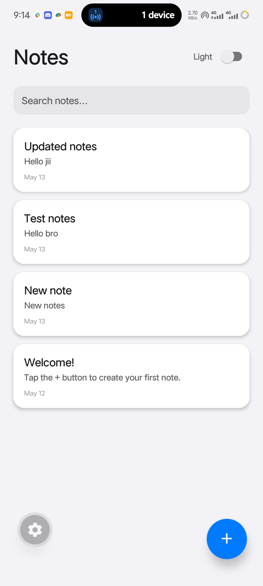
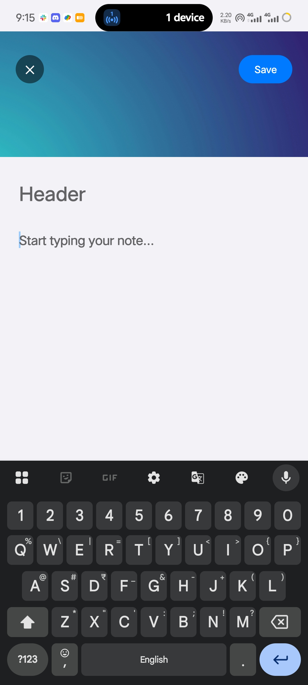
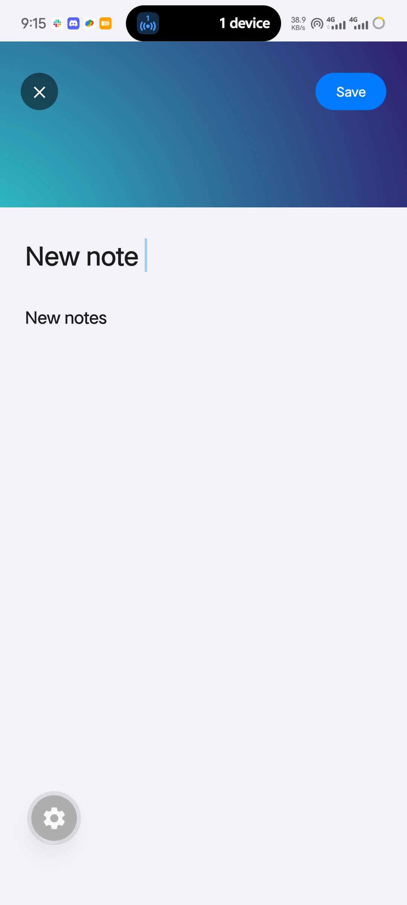
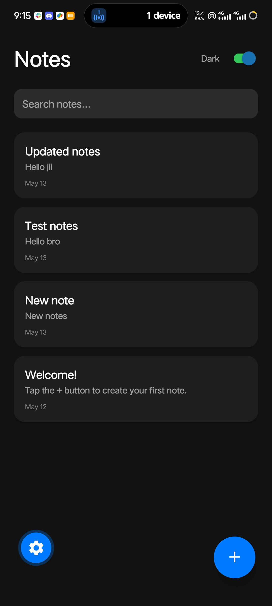
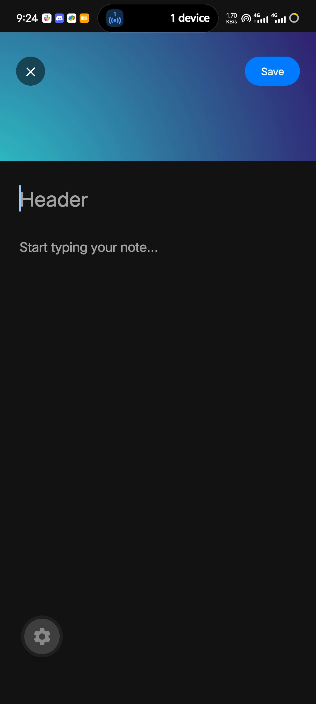
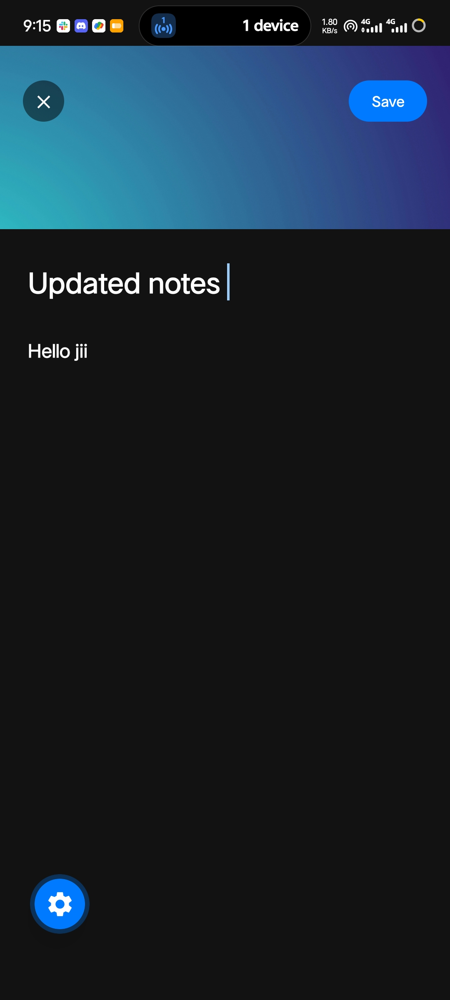

# 📝 Notes App

A beautiful, feature-rich note-taking application built with React Native and Expo. Create, edit, search, and organize your notes with a sleek dark/light mode interface.

## ✨ Features

- **📱 Create Notes** - Easily create new notes with a title and content using an intuitive editor with a beautiful image header
- **✏️ Edit Notes** - Open and modify existing notes with full editing capabilities
- **💾 Save Changes** - Save your new notes or updates with a single tap
- **🔍 Search** - Quickly find notes by searching through titles and content
- **🌓 Dark/Light Mode** - Toggle between dark and light themes with a smooth switch
- **📅 Date Tracking** - Each note automatically records the creation date
- **🎨 Beautiful UI** - Modern design with smooth animations and responsive layouts
- **⚡ Optimized Performance** - Memoized components for fast, smooth interactions
- **🛡️ Safe Area Support** - Proper handling of notches and safe areas on all devices
- **⌨️ Keyboard Handling** - Smart keyboard avoidance on iOS and Android

## 📸 Screenshots

### Light Mode

<div style="display: flex; gap: 10px; justify-content: space-around; margin: 20px 0;">
  
  
  
</div>

### Dark Mode

<div style="display: flex; gap: 10px; justify-content: space-around; margin: 20px 0;">
  
  
  
</div>

## 🚀 Getting Started

### Prerequisites

- Node.js (v14 or higher)
- npm or yarn
- Expo CLI: `npm install -g expo-cli`

### Installation

1. **Install dependencies**

   ```bash
   npm install
   ```

2. **Start the app**

   ```bash
   npx expo start
   ```

3. **Open on your device**

   In the terminal output, you'll find options to open the app:
   - Press `a` for Android emulator
   - Press `i` for iOS simulator
   - Scan the QR code with Expo Go app on your phone

## 🎯 Usage Guide

### Creating a Note

1. Tap the **+** button in the bottom-right corner
2. Enter a title in the "Header" field (optional)
3. Type your note content in the main text area
4. Tap **Save** to create the note
5. The note will appear at the top of your notes list with today's date

### Editing a Note

1. Tap on any note from the list
2. Edit the title or content as needed
3. Tap **Save** to update the note
4. Tap **✕** to discard changes and go back

### Searching Notes

1. Use the search bar at the top of the notes list
2. Type keywords to search through note titles and content
3. Results update in real-time as you type

### Switching Themes

1. Tap the **Light/Dark** toggle in the top-right corner
2. The entire app will switch to your preferred theme
3. Your choice is maintained during your session

## 🛠️ Tech Stack

- **React Native** - Cross-platform mobile app framework
- **Expo Router** - File-based routing system
- **React Hooks** - State management (useState, useMemo, useCallback)
- **TypeScript** - Type safety
- **Expo** - Development platform and build tools
- **React Native Safe Area Context** - Safe area handling

## 📁 Project Structure

```
notes-app/
├── src/
│   └── app/
│       ├── _layout.tsx      # Router configuration
│       └── index.jsx         # Main app component
├── assets/
│   ├── screenshots/          # App screenshots
│   ├── images/               # App images
│   └── expo.icon/            # App icon
├── package.json              # Dependencies
├── app.json                  # Expo configuration
└── tsconfig.json             # TypeScript config
```

## 🎨 Design Highlights

- **Responsive Layout** - Adapts beautifully to different screen sizes
- **Smooth Animations** - Press feedback with opacity and scale transforms
- **Typography** - Clear hierarchy with bold headers and readable body text
- **Color Schemes**:
  - Light: Clean whites and light grays with dark text
  - Dark: Deep blacks and dark grays with white text
- **Shadows & Elevation** - Platform-specific shadows for depth (iOS) and elevation (Android)

## 📱 Platform Support

- ✅ iOS (iPhone, iPad)
- ✅ Android (Phones, Tablets)
- ✅ Web (Limited support)
- ✅ Expo Go

## 🔧 Available Scripts

```bash
# Start development server
npm start

# Run on Android
npm run android

# Run on iOS
npm run ios

# Run on Web
npm run web

# Lint code
npm run lint

# Reset project to fresh state
npm run reset-project
```

## 🐛 Troubleshooting

### App won't start
- Clear cache: `expo start -c`
- Reinstall dependencies: `rm -rf node_modules && npm install`

### Keyboard issues
- Ensure `KeyboardAvoidingView` is properly configured for your platform
- On Android, check that the activity's `windowSoftInputMode` is set correctly

### Theme not persisting
- Currently theme is session-based. Integrate AsyncStorage for persistence if needed

## 📚 Dependencies

- `expo@~55.0.23` - Main Expo framework
- `react-native@0.83.6` - React Native core
- `react@19.2.0` - React library
- `expo-router@~55.0.14` - File-based routing
- `react-native-safe-area-context@~5.6.2` - Safe area support

## 🤝 Contributing

Feel free to fork this project and submit pull requests for any improvements!

## 📄 License

This project is open source and available under the MIT License.

## 💡 Future Enhancements

- [ ] Note categories/tags
- [ ] Rich text formatting (bold, italic, lists)
- [ ] Note sharing functionality
- [ ] Cloud synchronization
- [ ] Note deletion with undo
- [ ] Offline support with local storage
- [ ] Pin important notes
- [ ] Note archiving
- [ ] Handwriting recognition
- [ ] Voice-to-text notes

## 📧 Support

For issues or questions, please open an issue in the repository.

---

Built with ❤️ using React Native and Expo

## Join the community

Join our community of developers creating universal apps.

- [Expo on GitHub](https://github.com/expo/expo): View our open source platform and contribute.
- [Discord community](https://chat.expo.dev): Chat with Expo users and ask questions.
